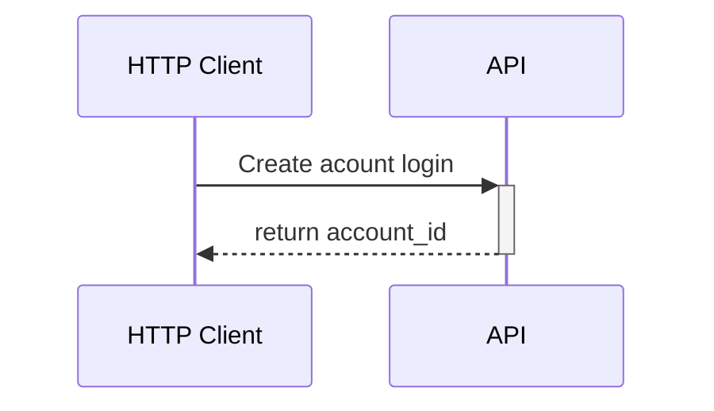
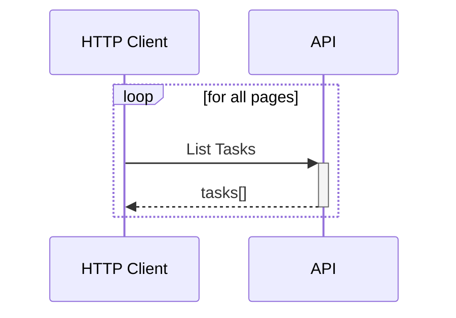
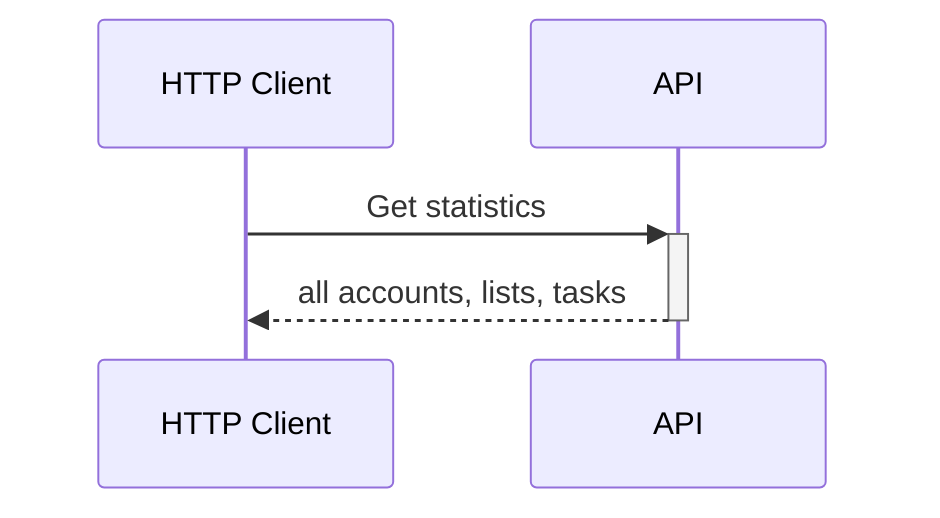

# Runner container

The runner uses [k6](https://k6.io/) to test the service specified in `SERVER_HOST` env var and execute the following load testing scenarios:


# Scenariis

## In which order should I launch the test?

1. scenario-INIT.js
2. scenario-DATA_WRITE.js
3. all other scenario-xxx.js


## scenario-INIT.js

To launch before all scenario



Account id should be retrieved with a tool as ansible and then injected as ACCOUNT_ID environment variables on the next scenarii.

## scenario-DATA_WRITE.js

```mermaid
sequenceDiagram
participant C as HTTP Client
    API-->>-C: list
    loop 20 times
        C->>+API: Create Task
        API-->>-C: task
    end
```

## scenario-DATA_LIST.js



## scenario-SIMPLE_ANALYTIC.js

